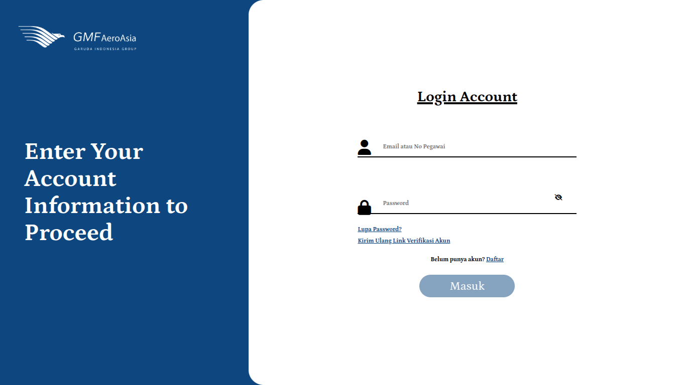
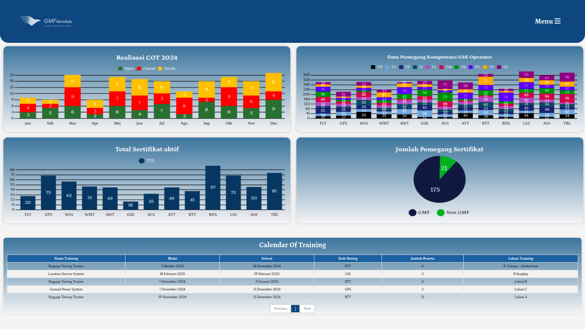
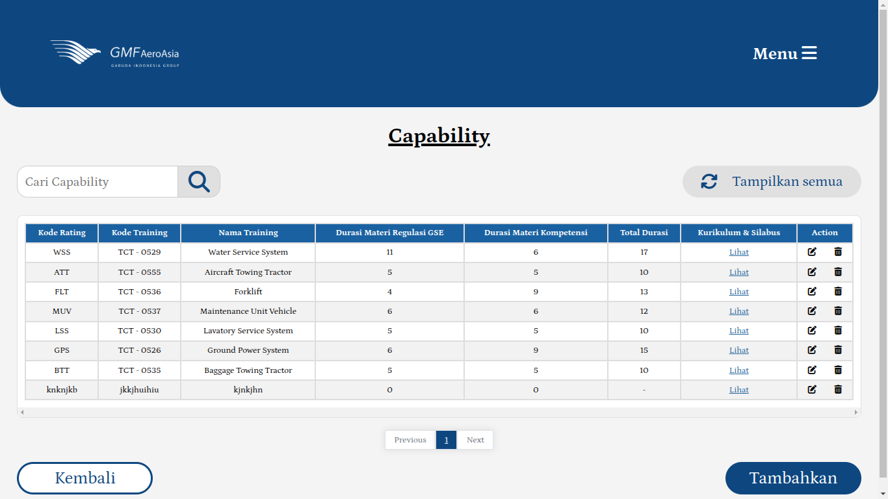
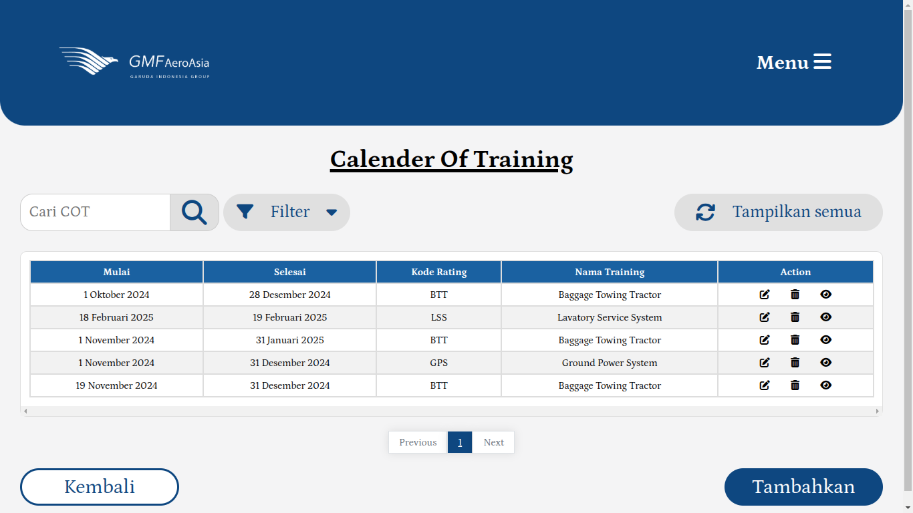
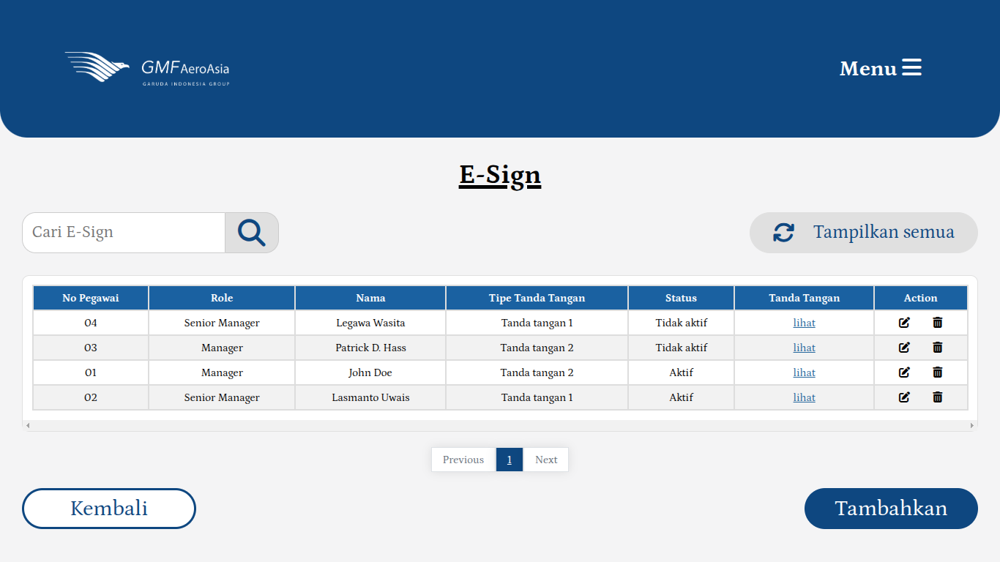
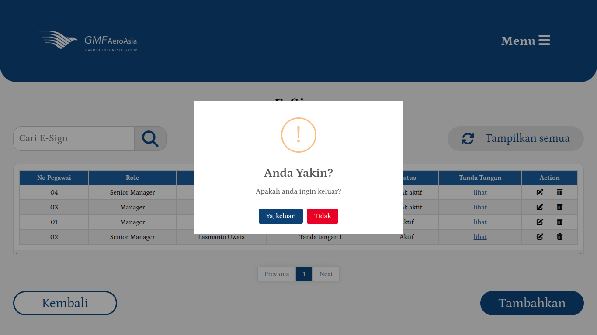

<div align="center">
  
  <h1>GMF Utility Training</h1>
  <p><i>Streamlined Training Management Platform for Utility Professionals</i></p>
</div>

[](https://github.com/GMF-Utility-Training/gmf-repo/issues)
[](https://github.com/GMF-Utility-Training/gmf-repo/pulls)
[](https://github.com/GMF-Utility-Training/gmf-repo/actions)

# GMF Utility Training Platform

Selamat datang di platform GMF Utility Training! 👋

GMF Utility Training adalah sistem manajemen pelatihan terpadu yang dirancang khusus untuk memudahkan pengelolaan, pemantauan, dan pelacakan program pelatihan utilitas. Platform ini menyediakan antarmuka yang user-friendly untuk administrator dan peserta pelatihan, memungkinkan pengelolaan sertifikasi dan kemajuan pembelajaran yang efisien dalam satu sistem terintegrasi.

## 🎯 Tujuan Platform

Platform ini dikembangkan untuk:
- Menyederhanakan manajemen program pelatihan utilitas
- Memudahkan pelacakan progress peserta pelatihan
- Mengotomatisasi pengelolaan sertifikasi
- Menyediakan analisis dan pelaporan yang komprehensif
- Memastikan kepatuhan terhadap standar pelatihan industri

## 👥 Tim Pengembang

Perkenalkan tim pengembang dari platform ini, masing-masing memiliki keahlian yang saling mendukung demi mewujudkan platform yang modern, solutif, dan inovatif.

| Name | University | GitHub | LinkedIn |
|------|-------------|---------|-----------|
| Aminudin Abdulloh | Institut Teknologi Dirgantara Adisutjipto | [GitHub](https://github.com/AminudinAbdulloh) | [LinkedIn](https://www.linkedin.com/in/aminudin-abdulloh-784157268) |
| Hassanul Resky Pratama | Institut Teknologi Dirgantara Adisutjipto | [GitHub](https://github.com/sanrskyprtma) | [LinkedIn](-) |
| Fatahillah Alif Pangaribowo | Institut Teknologi Dirgantara Adisutjipto | [GitHub](https://github.com/pangaribowo) | [LinkedIn](https://www.linkedin.com/in/fatahillahalif) |
| Faradila Galuh Pramesti | Bina Sarana Informatika | [GitHub](-) | [LinkedIn](https://linkedin.com/in/faradilagprm) |

## 💻 Teknologi

Platform ini dibangun menggunakan stack teknologi modern:

- **Frontend:** Angular
- **Backend:** NestJS
- **Database:** PostgreSQL
- **Infrastruktur:** Cloud-based deployment
- **Authentication:** JWT-based security
- **API:** RESTful architecture

## 📱 Tampilan Platform

<p align="center">
  
  
  
  
  
  
</p>

## 🌟 Fitur Utama

### Untuk Administrator
- Dashboard manajemen pelatihan komprehensif
- Sistem pengelolaan peserta dan grup
- Manajemen sertifikasi otomatis
- Pelaporan dan analitik detail
- Pengaturan jadwal pelatihan

### Untuk Peserta
- Portal peserta yang intuitif
- Pelacakan kemajuan pembelajaran
- Akses dan unduh sertifikat
- Riwayat pelatihan personal
- Notifikasi dan pengingat

## 🚀 Memulai

### Prasyarat
- Node.js (v14 atau lebih baru)
- Angular CLI
- PostgreSQL
- Docker (opsional)

### Instalasi

1. Clone repositori:
```bash
git clone https://github.com/GMF-Utility-Training/tu-repo.git
cd tu-repo
```

2. Install dependensi:
```bash
# Install frontend dependencies
cd frontend
npm install

# Install backend dependencies
cd ../backend
npm install
```

3. Konfigurasi environment:
```bash
# Copy environment template
cp .env.example .env

# Sesuaikan konfigurasi database dan credentials
```

4. Jalankan aplikasi:
```bash
# Start backend
cd backend
npm run start:dev

# Start frontend (in new terminal)
cd frontend
ng serve
```

## 📚 Dokumentasi

Dokumentasi lengkap tersedia di folder `/docs`:

- [Panduan Instalasi](/docs/installation.md)
- [Konfigurasi Sistem](/docs/configuration.md)
- [API Documentation](/docs/api-docs.md)
- [User Guide](/docs/user-guide.md)

## 🤝 Kontribusi

Kami menyambut kontribusi dari komunitas. Untuk berkontribusi:

1. Fork repositori
2. Buat branch fitur (`git checkout -b feature/AmazingFeature`)
3. Commit perubahan (`git commit -m 'Add AmazingFeature'`)
4. Push ke branch (`git push origin feature/AmazingFeature`)
5. Buat Pull Request

Pastikan untuk membaca [CONTRIBUTING.md](CONTRIBUTING.md) untuk informasi detail tentang proses kontribusi.

## 📝 Lisensi

Proyek ini dilisensikan di bawah MIT License - lihat file [LICENSE.md](LICENSE.md) untuk detail.

## 📞 Kontak

- Email: support@gmfutilitytraining.com
- Website: www.gmfutilitytraining.com
- Telepon: (021) XXXX-XXXX

## 🙏 Pengakuan 😆

Terima kasih kepada semua kontributor yang telah membantu mengembangkan platform ini:

- Tim Pengembangan GMF
- Divisi Training & Development
- Tim Quality Assurance
- Semua pengguna yang telah memberikan feedback berharga

<div align="center">
  <p>© 2025 GMF Utility Training Developers. All rights reserved.</p>
</div>
